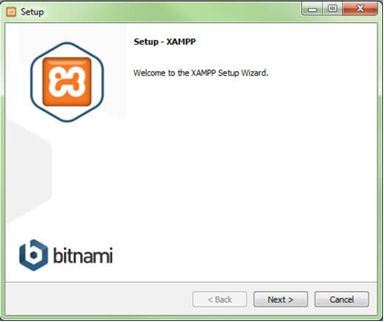

<h1 style="text-align:center"> Lab 1:  Cài đặt Web server </h1>

- [GIỚI THIỆU WEB SERVER](#intro)  
- [GIỚI THIỆU XAMPP](#intro_xampp)  
- [CÀI ĐẶT XAMPP](#install_xampp)  

## GIỚI THIỆU WEB SERVER <a name="intro" />
•	Web server (máy phục vụ Web): máy tính mà trên đó cài đặt phần mềm phục vụ web, đôi khi người ta cũng gọi chính phần mềm đó là web server.

•	Tất cả các web server đều hiểu và chạy được các file *.htm và *.html, tuy nhiên mỗi web server lại phục vụ một số kiểu file chuyên biệt, chẳng hạn như IIS của Microsoft dành cho *.asp, *.aspx…; Sun Java System Web Server của SUN dành cho *.jsp…; Apache dành cho *.php…Tuỳ thuộc vào ngôn ngữ lập trình web mà lựa chọn web server cho phù hợp. Ví dụ nếu bạn chạy PHP thì dùng Apache. 

•	Một web server để có thể chạy được các ứng dụng của PHP thì phải tồn tại những thành phần sau: Apache – PHP – MySQL. Trước đây chúng ta thường phải cài từng phần riêng biệt nhưng bây giờ thì đã có gói web server tích hợp đầy đủ các thành phần cơ bản này. 

•	Một số gói web server có sẵn có thể chạy được ứng dụng PHP là: AppServ, WAMP, XAMPP, Vertrigo. Các bạn chọn một trong các gói này để cài đặt web server là có thể chạy được ứng dụng PHP.

## GIỚI THIỆU XAMPP <a name="intro_xampp" />

•	XAMPP là chương trình tích hợp sẵn các ứng dụng cần thiết để tạo và vận hành một máy chủ web. Chữ X trong cụm từ XAMPP ám chỉ cross-platform có nghĩa là XAMPP có thể chạy trên nhiều nền tảng khác nhau như Windows, Linux, Mac, Solaris. Các ký tự còn lại trong cụm từ có ý nghĩa như sau:

- A = Apache: XAMPP bao gồm một Apache HTTP Server dùng để chạy các ứng dụng web.

- M = MySQL: XAMPP cũng bao gồm hệ quản trị cơ sở dữ liệu MySQL.

- P = PHP: ngôn ngữ lập trình PHP.

- P = Perl: ngôn ngữ lập trình Perl.

Ngoài ra, XAMPP còn có các thành phần khác như:

- PEAR (PHP Extension and Application Repository), một thư viện mã của PHP.
- Perl: một ngôn ngữ lập trình rất thông dụng.
- phpMyAdmin: một giao diện Web-based đến MySQL server. 
- Mail server (để gửi email).

## CÀI ĐẶT XAMPP <a name="install_xampp" />

	Bước 1. Tải XAMPP về máy tính tại: https://www.apachefriends.org/download.html. 

Sau khi download thành công, double click vào file exe để cài đặt. 

