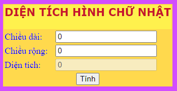
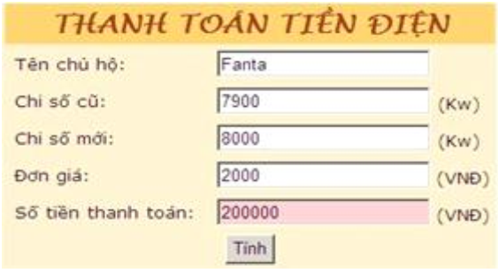
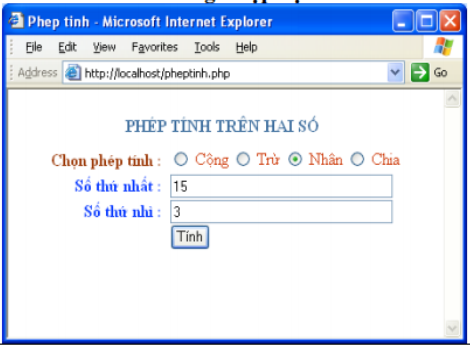
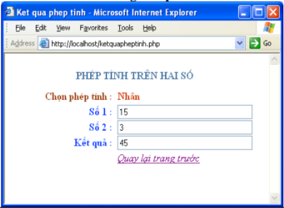
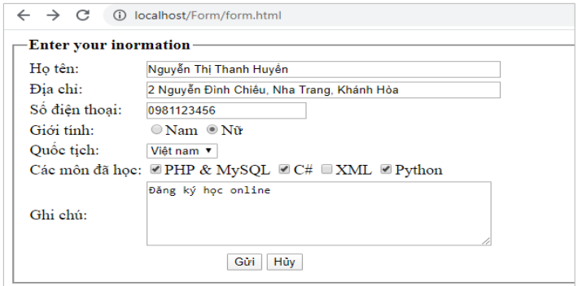

<h1>Bài tập thực hành phần Form</h1>

- [Bài tập khởi động](#bt_khoidong) <br>		
- [Bài tập tổng hợp](#bt_tonghop) <br>

## Bài tập khởi động <a name="bt_khoidong" />

### Thực hiện tạo các form đơn giản. SV làm quen với hai phương thức POST và GET, sử dụng sticky form trong PHP.
**Lưu ý:** 
  
~ Mỗi bài tập ở phần này SV tạo một file có tên được gợi ý trong thuộc tính action của thẻ form. 

~ Sau khi thực hiện xong mỗi bài, SV Xem lại code để nắm vững cách sử dụng PHP được lồng ghép với các thẻ HTML.

~ Các bài tập này sẽ là bài mẫu để SV có thể tra cứu cách sử dụng các thành phần nhập liệu trong form.

- [Bài 1: Tạo form nhập liệu với text field (dạng 1)](#btkd_1) <br>
- [Bài 2: Tạo form nhập liệu với text field (dạng 2)](#btkd_2) <br>
- [Bài 3: Tạo form nhập liệu với multipleline text (textarea)](#btkd_3) <br>
- [Bài 4: Tạo form nhập liệu với hộp kiểm checkbox](#btkd_4) <br>
- [Bài 5: Tạo form nhập liệu với hộp kiểm radio button](#btkd_5) <br>
- [Bài 6: Tạo form nhập liệu với danh sách dạng combo box](#btkd_6) <br>
- [Bài 7: Tạo form nhập liệu với danh sách dạng list box](#btkd_7) <br>

### Bài 1: Tạo form nhập liệu với text field (dạng 1)<a name="btkd_1" />
```php
<html> 
<head>
	<title>Input/Ouput data</title></head>
<body>
<form action="input_xuly.php" name="myform" method="post">
	Your Name: <input type="test" name="Name" size=20 value="<?php if(isset($_POST['Name'])) echo $_POST['Name'];?>" />
	<br>
	<input type="submit" value="Submit">
</form>
<?php
	if (isset($_POST["Name"]))
		print "Hello " . $_POST["Name"];
?>
</body>
</html>
```
### Bài 2: Tạo form nhập liệu với text field (dạng 2)<a name="btkd_2" />
```php
<html> 
<head>
<title>Input data</title>
</head>
<body>
	<form action="names.php" name="myform" method="post">
		First Name: <input type="text" name="Name[]" size=20 value="<?php if(isset($_POST['Name'])) echo $_POST['Name'][0];?>"/><br>
		Last Name: <input type="text" name="Name[]" size=20 value="<?php if(isset($_POST['Name'])) echo $_POST['Name'][1];?>"/><br>
		<input type="submit" value="Submit">
	</form>
	
	<?php
		if (isset($_POST['Name'])){
			echo "Chào bạn " . $_POST['Name'][0] . " " . $_POST['Name'][1];
		}
	?>
</body>
</html>
```
### Bài 3: Tạo form nhập liệu với multipleline text (textarea)<a name="btkd_3" />
```php
<html> 
<head>
	<title>Input/Ouput data</title></head>
<body>
<form action="textarea.php" name="myform" method="post">
	Your comment: 
	<br>
	<textarea name="comment" rows="3" cols="40"><?php if(isset($_POST['comment'])) echo $_POST['comment']; ?></textarea>
	<br>
	<input type="submit" value="Submit">
</form>
<?php
	if (isset($_POST["comment"]))
		print "Your comment: " . $_POST["comment"];
?>
</body>
</html>
```
### Bài 4: Tạo form nhập liệu với hộp kiểm checkbox<a name="btkd_4" />
```php
<html>
<body>
<form method="post" action="checkbox.php">
	<input type="checkbox" name="chk1" value="en" 
		<?php if(isset($_POST['chk1'])&& $_POST['chk1']=='en') echo 'checked'; else echo ""?>/>English <br> 
	<input type="checkbox" name="chk2" value="vn"
		<?php if(isset($_POST['chk2'])&& $_POST['chk2']=='vn') echo 'checked'; else echo ""?>/>Vietnam<br>
	
	<input type="submit" value="submit"><br>
</form>

<?php
	if(isset($_POST['chk1'])) echo "checkbox 1 : " . $_POST['chk1'] . "<br>";
	if(isset($_POST['chk2'])) echo "checkbox 2 : " . $_POST['chk2'];
		
?>

</body>
</html>
```

### Bài 5: Tạo form nhập liệu với hộp kiểm radio button<a name="btkd_5" />
```php
<html>
<body>
	<form action="radio.php" name="myform" method="post">
	<input type="radio" name="radGT" value="Nam"<?php if(isset($_POST['radGT'])&&$_POST['radGT']=='Nam') echo 'checked="checked"';?> checked/>		Nam<br>
	<input type="radio" name="radGT" value="Nu" <?php if(isset($_POST['radGT'])&&$_POST['radGT']=='Nu') echo 'checked="checked"';?>/>
			N&#7919;<br>

	<input type="submit" value="Submit">
</form>
	
	<?php
		if (isset($_POST['radGT'])){
			echo "Gioi tinh : " . $_POST['radGT'];
		}
	?>
</body>
</html>
```
### Bài 6: Tạo form nhập liệu với danh sách dạng combo box<a name="btkd_6" />
```php
<html>
<body>
	<form method="POST" action="combobox.php">
		<select name="lunch">
			<option value="pork" <?php if(isset($_POST['lunch'])&& $_POST['lunch']=='pork') echo 'selected';?>>
				BBQ Pork Bun
			</option>
			<option value="chicken" <?php if(isset($_POST['lunch'])&& $_POST['lunch']=='chicken') echo 'selected';?>>
				Chicken Bun
			</option>
			<option value="lotus" <?php if(isset($_POST['lunch'])&& $_POST['lunch']=='lotus') echo 'selected';?>>
				Lotus Seed Bun
			</option>
		</select>
		<input type="submit" name="submit" value="Submit your order">
	</form>
	Selected buns:<br/>
	<?php
		if (isset($_POST['lunch'])){
			print 'You want a ' . $_POST["lunch"] . ' bun. <br/>';
		}
	?>
</body>
</html>
```
### Bài 7: Tạo form nhập liệu với danh sách dạng list box<a name="btkd_7" />
```php
<html>
<body>
<form method="POST" action="listbox.php">
	<select name="lunch[]" multiple>
		<option value="pork"  selected>
			BBQ Pork Bun
		</option>
		<option value="chicken">
			Chicken Bun
		</option>
		<option value="lotus">
			Lotus Seed Bun
		</option>
	</select>
	<p>
	<input type="submit" name="submit" value="Submit your order">
</form>

Selected buns:<br/>
<?php
	if (isset($_POST['lunch'])) {
		foreach ($_POST['lunch'] as $choice) {
	    	print "You want a $choice bun. <br/>";
		}
		
	}
?>
</body>
</html>
```
## Bài tập tổng hợp<a name="bt_tonghop" />

### Thực hiện tạo các form nâng cao.
**Lưu ý:** 
  
~ Mỗi bài tập ở phần này SV tạo form theo yêu cầu, kết hợp sử dụng các thành phần khác nhau của form.
~ SV nộp bài tập trên tài khoản GitHub của cá nhân.

- [Bài 1: Thiết kế form tính diện tích hình chữ nhật](#btth_1) <br>
- [Bài 2: Thiết kế Form tính tiền điện](#btth_2) <br>
- [Bài 3: Tạo trang web thực hiện phép tính trên 2 số](#btth_3) <br>
- [Bài 4: Tạo trang web nhận và xử lý thông tin người dùng](#btth_4) <br>


### Bài 1: Thiết kế form tính diện tích hình chữ nhật<a name="btth_1" />
 <br>

**Yêu cầu:**
- Đặt tên cho form
- Thiết lập phương thức cho form là POST, action của form là tên của trang
- Sử dụng CSS để thiết kế form
- Textfield Diện tích không cho phép nhập liệu và chỉnh sửa
- Khi chọn button Tính, thực hiện tính Diện tích của hình chữ nhật

### Bài 2: Thiết kế form tính tiền điện<a name="btth_2" />
 <br>
**Yêu cầu:**
- Đặt tên cho form
- Thiết lập phương thức cho form là POST, action của form là tên của trang
- Sử dụng CSS để thiết kế form
- Textfield Số tiền thanh toán không cho phép nhập liệu
và chỉnh sửa
- Giá trị mặc định của Đơn giá là 20000
- Khi chọn button Tính:
	a. Kiểm tra giá trị của các trường có hợp lệ không.
	b. Thực hiện tính Số tiền thanh toán = (Chỉ số mới – Chỉ số cũ)*Đơn giá

### Bài 3: Tạo trang web thực hiện phép tính trên 2 số<a name="btth_3" />
**Yêu cầu:**
- Sử dụng CSS để thiết kế form
- Tạo trang Nhập liệu: Cho người dùng chọn phép tính, nhập giá trị 2 số. 

 <br>

- Sau khi nhấn nút Tính:

a. Kiểm tra các giá trị nhập vào có hợp lệ (kiểu số, không để trống)

b. Nếu các giá trị hợp lệ thì chuyển sang trang Trang kết quả:

  <br>
- Trang Kết quả: Hiện phép tính đã chọn, giá trị của 2 số và kết quả của phép tính. Trong trang này có link cho người dùng quay về trang Nhập liệu.

- Có thể dùng hàm để viết các hàm cộng, trừ, nhân, chia cho 2 số.
- Sử dụng CSS cho định dạng màu chữ, Canh lề chữ trong textbox.
- Sử dụng đối tượng window.history trong javascript để quay lại trang trước đó.
```
<a href="javascript:window.history.back(-1);">Tro ve trang truoc</a>
```
 
### Bài 4: Tạo trang web nhận và xử lý thông tin người dùng<a name="btth_4" />
**Yêu cầu:**
- Trang nhapThongtin.htm:
  + Sau khi nhấn nút **Gửi**: Trang xulyThongtin.php được hiển thị.
  + Nếu nhấn nút **Hủy**: Các thông tin được nhập vào sẽ bị xóa.

 <br>
- Trang xulyThongtin.php: 
  + Được hiển thị sau khi nút Gửi của trang nhapThongtin.html được nhấn, và lần lượt hiển thị thông tin của người dùng đã được xác lập trước đó. 
  + Trang này có nút **Quay về** để trở lại trang trước.

 <br>