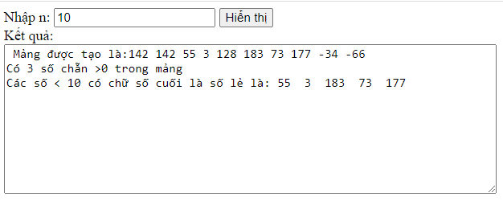
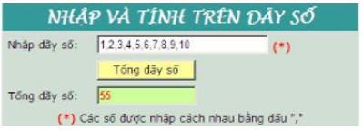
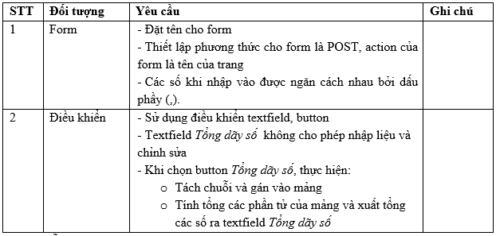
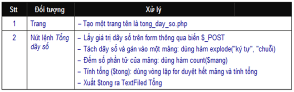
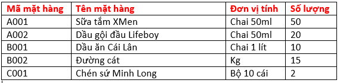

<h1>Bài tập thực hành phần Mảng và Chuỗi</h1>

- [Bài tập khởi động](#bt_khoidong) <br>		
- [Bài tập tổng hợp](#bt_tonghop) <br>

## Bài tập khởi động <a name="bt_khoidong" />

### Thực hiện lại một số thao tác xử lý cơ bản trên mảng và chuỗi.


- [Bài 1: Tạo mảng xử lý một số thao tác cơ bản](#btkd_1) <br>
- [Bài 2: Sắp xếp danh sách](#btkd_2) <br>


### Bài 1: Tạo mảng xử lý một số thao tác cơ bản<a name="btkd_1" />
- Tạo form thực hiện một số yêu cầu sau:

	- Nhập vào một số nguyên dương n, sau đó tạo một mảng có n phần tử, giá trị của các phần tử trong phạm vi [-200,200].

	- In ra mảng vừa mới tạo.

	- Tìm và in ra các số dương chẵn trong mảng

	- Tìm và hiển thị các phần tử có chữ số cuối là số lẻ.

```php
<!DOCTYPE html>
<head>
	<meta http-equiv="Content-Type" content="text/html; charset=utf-8"/>
	<title>Xử lý n</title>
</head>
<body>
<?php
	if(isset($_POST['n'])) $n=$_POST['n'];
	else $n=0;

	$ketqua="";
	if(isset($_POST['hthi'])) 
	{	//Tạo mảng có n phần tử, các phần tử có giá trị [-100,100]
		$arr=array();
		for($i=0;$i<$n;$i++)
		{
			$x=rand(-200,200);
			$arr[$i]=$x;
		}
		//In ra mảng vừa tạo
		$ketqua="Mảng được tạo là:" .implode(" ",$arr)."&#13;&#10;";

		//Tìm và in ra các số dương chẵn trong mảng dùng hàm foreach
		$count=0;
		foreach($arr as $v){
			if($v%2==0 && $v>0 )
				$count++;
		}
		$ketqua.="Có $count số chẵn >0 trong mảng". "&#13;&#10;";

		//Tìm và in ra các số <n có chữ số cuối là số lẻ
		$ketqua .="Các số < $n có chữ số cuối là số lẻ là: ";
		$daySo = "";
		for($i=0;$i<count($arr);$i++){
			$soCuoi = $arr[$i]%10;
			if($soCuoi %2 !=0)
				$daySo .= "$arr[$i]  ";
		}
		$ketqua .= $daySo;
				
	}
?>
<form action="" method="post">
	Nhập n: <input type="text" name="n" value="<?php echo $n?>"/>
	<input type="submit" name="hthi" value="Hiển thị"/>
	Kết quả: <br>
	<textarea cols="70" rows="10" name="ketqua"> <?php echo $ketqua?></textarea>
</form>
</body>
</html>
```
Kết quả hiển thị:

 <br>


### Bài 2: Sắp xếp danh sách<a name="btkd_2" />


- Cho trước một danh sách bài hát chưa sắp xếp. Yêu cầu sắp xếp lại bài hát theo thứ tự bình bầu.
```php
<!DOCTYPE HTML PUBLIC "-//W3C//DTD HTML 4.01 Frameset//EN">
<html>
<head>
<meta http-equiv="Content-Type" content="text/html; charset=utf-8">
<title>Insert title here</title>
</head>
<body>
<?php 
	$songlist=array(
		"Hoa nở không màu"=>1,
		"Em gái mưa"=>4,
		"Bậu ơi đừng khóc"=>3,
		"Xin chào Việt Nam"=>2);
	?>
	 <h2>Danh sách bài hát chưa sắp xếp</h2>
	 <table border="1">
	 	<tr>
	 		<th>
	 			<b>Bài hát</b>
	 		</th>
	 		<th><b>Hạng</b></th>
	 	</tr>
	 <?php 
	 	foreach($songlist as $k=>$v){
	 		echo "<tr>
	 				<td>$k</td>
	 				<td>$v</td>
	 			 </tr>";
	 	}
	 ?>
	 </table>
	 
	 <?php  
	 		//Sắp xếp danh sách bài hát theo hạng
	 	asort($songlist);
	 ?>

	 <h2>Danh sách bài hát sau khi sắp</h2>
	 <table border="1">
	 	<tr>
	 		<th>
	 			<b>Bài hát</b>
	 		</th>
	 		<th><b>Hạng</b></th>
	 	</tr>
	 <?php 
	 	foreach($songlist as $k=>$v){
	 		echo "<tr>
	 				<td>$k</td>
	 				<td>$v</td>
	 			 </tr>";
	 	}
 ?>
 </table>
</body>
</html>
```
**Lưu ý**:

- SV thực hiện lại chương trình bằng cách thay thế hàm asort bởi một số hàm sắp xếp khác (sort, rsort, ksort, krsort). Quan sát kết quả trên trình duyệt rồi rút ra kết luận.


## Bài tập tổng hợp<a name="bt_tonghop" />


- [Bài 1: Viết hàm xử lý số](#btth_1) <br>
- [Bài 2: Thiết kế Form nhập và tính trên dãy số](#btth_2) <br>
- [Bài 3: Bài toán xổ số kiến thiết](#btth_3) <br>
- [Bài 4: Bài toán thao tác trên ma trận](#btth_4) <br>
- [Bài 5: Bài toán quản lý thông tin mặt hàng](#btth_5) <br>

### Bài 1: Viết hàm xử lý số<a name="btth_1" />

Tạo form nhập vào 1 số tự nhiên n. Sử dụng hàm rand() (đưa ra số interger ngẫu nhiên) để phát sinh dữ liệu cho mảng có độ dài n. Sau đó viết hàm thực hiện các yêu cầu sau:

a- Hiển thị mảng phát sinh ngẫu nhiên có độ dài n.

b- Sắp xếp mảng tăng dần theo giá trị.

c- Chèn một số vào vị trí bất kỳ trong mảng. In ra mảng sau khi chèn số.

d- Sắp xếp mảng theo dạng sau: Từ phần tử đầu tiên đến phần tử được chèn vào là tăng dần; từ phần tử được chèn vào đến phần tử cuối là giảm dần.

**Yêu cầu:**
- Kiểm tra n nhập vào có thỏa điều kiện bài toán.
- Các kết quả được hiển thị trong 1 khung textarea.

### Bài 2: Thiết kế Form nhập và tính trên dãy số<a name="btth_2" />
 <br>

**Yêu cầu thiết kế:**

 <br>

**Hướng dẫn**

 <br>

### Bài 3: Bài toán xổ số kiến thiết<a name="btth_3" />
Tạo form hiển thị kết quả xổ số kiến thiết trong một ngày nào đó (Sử dụng hàm rand() để tạo số). Sau đó nhập vào vé số của người mua, rồi cho biết họ có trúng giải không? Nếu có thì trúng giải mấy?

**Yêu cầu:**
- Sử dụng hàm và mảng để xử lý.

### Bài 4: Bài toán thao tác trên ma trận<a name="btth_4" />
Tạo form nhập vào 2 giá trị n, m nguyên dương. Sau đó tạo một ma trận có các phần tử là các số ngẫu nhiên trong khoảng [-200,200].
- In ra ma trận vừa mới tạo.
- Đếm số phần tử có chữ số cuối là số lẻ. 
- Thay thế các phần tử khác 0 thành 1. In ra ma trận sau khi thay thế. 

**Yêu cầu:**
- Sử dụng hàm, lệnh foreach và mảng hai chiều để xử lý.

### Bài 5: Bài toán quản lý thông tin mặt hàng<a name="btth_5" />
Cho bảng dữ liệu sau:

 <br>

**Yêu cầu:**
- Sử dụng mảng 2 chiều để lưu trữ bảng dữ liệu trên.
- In ra mảng dữ liệu này như mẫu.
- Tạo form nhập thông tin của một mặt hàng vào danh sách. In ra danh sách sau khi thêm một mặt hàng. 
