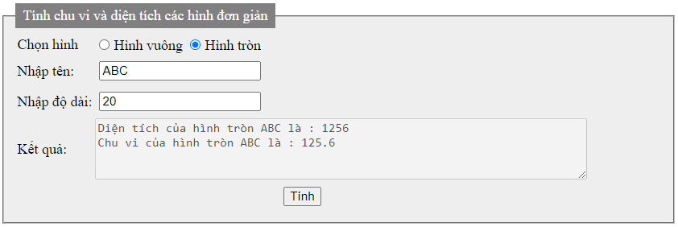
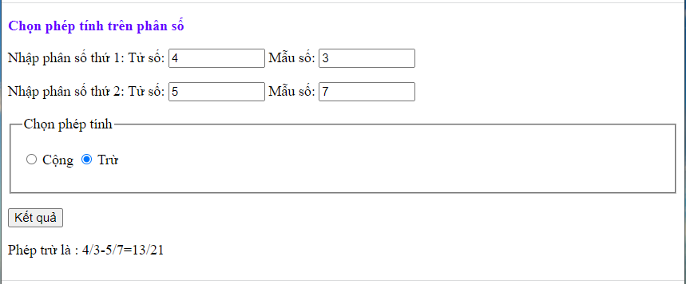
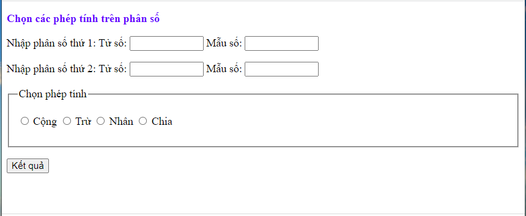

<h1>Bài tập thực hành phần Lập trình hướng đối tượng</h1>

- [Bài tập khởi động](#bt_khoidong) <br>		
- [Bài tập tổng hợp](#bt_tonghop) <br>

## Bài tập khởi động <a name="bt_khoidong" />

### Thực hiện lại một số bài toán về lập trình hướng đối tượng trong bài giảng.


- [Bài 1: Tạo form tính chu vi và diện tích một số hình học đơn giản](#btkd_1) <br>
- [Bài 2: Bài toán về phân số](#btkd_2) <br>


### Bài 1: Tạo form tính chu vi và diện tích một số hình học đơn giản<a name="btkd_1" />
- Tạo form thực hiện các yêu cầu sau:

	- Chọn hình vuông hay hình tròn.

	- Nhập vào tên và độ dài của hình.

	- Tính và hiển thị kết quả chu vi và diện tích của loại hình tương ứng được chọn. 

Kết quả hiển thị:

 <br>

- Chương trình mẫu:


```php
<!DOCTYPE HTML PUBLIC "-//W3C//DTD HTML 4.01 Frameset//EN">
<html>
<head>
<meta http-equiv="Content-Type" content="text/html; charset=utf-8">
<title>Tinh chu vi va dien tich</title>
<style>
fieldset {
  background-color: #eeeeee;
}

legend {
  background-color: gray;
  color: white;
  padding: 5px 10px;
}

input {
  margin: 5px;
}
</style>
</head>
<body>
<?php 
abstract class Hinh{
	protected $ten, $dodai;
	public function setTen($ten){
		$this->ten=$ten;
	}
	public function getTen(){
		return $this->ten;
	}
	public function setDodai($doDai){
		$this->dodai=$doDai;
	}
	public function getDodai(){
		return $this->dodai;
	}
	abstract public function tinh_CV();
	abstract public function tinh_DT();
}
class HinhTron extends Hinh{
	const PI=3.14;
	function tinh_CV(){
		return $this->dodai*2*self::PI;
	}
	function tinh_DT(){
		return pow($this->dodai,2)*self::PI;
	}
}
class HinhVuong extends Hinh{
	public function tinh_CV(){
		return $this->dodai*4;
	}
	public function tinh_DT(){
		return pow($this->dodai,2);
	}
}
$str=NULL;
if(isset($_POST['tinh'])){
	if(isset($_POST['hinh']) && ($_POST['hinh'])=="hv"){
		$hv=new HinhVuong();
		$hv->setTen($_POST['ten']);
		$hv->setDodai($_POST['dodai']);
		$str= "Diện tích hình vuông ".$hv->getTen()." là : ".$hv->tinh_DT()." \n".
		 		"Chu vi của hình vuông ".$hv->getTen()." là : ".$hv->tinh_CV();
	}
	if(isset($_POST['hinh']) && ($_POST['hinh'])=="ht"){
		$ht=new HinhTron();
		$ht->setTen($_POST['ten']);
		$ht->setDodai($_POST['dodai']);
		$str= "Diện tích của hình tròn ".$ht->getTen()." là : ".$ht->tinh_DT()." \n".
				"Chu vi của hình tròn ".$ht->getTen()." là : ".$ht->tinh_CV();
	}
}
?>
<form action="" method="post">
<fieldset>
	<legend>Tính chu vi và diện tích các hình đơn giản</legend>
	<table border='0'>
		<tr>
			<td>Chọn hình</td>
			<td><input type="radio" name="hinh" value="hv" 
					<?php if(isset($_POST['hinh'])&&($_POST['hinh'])=="hv") echo 'checked'?>/>Hình vuông
				<input type="radio" name="hinh" value="ht"
					<?php if(isset($_POST['hinh'])&&($_POST['hinh'])=="ht") echo 'checked'?>/>Hình tròn
			</td>
		</tr>
		<tr>
			<td>Nhập tên:</td>
			<td><input type="text"  name="ten" value="<?php if(isset($_POST['ten'])) echo $_POST['ten'];?>"/></td>
		</tr>
		<tr>
			<td>Nhập độ dài:</td>
			<td><input type="text"  name="dodai" value="<?php if(isset($_POST['dodai'])) echo $_POST['dodai'];?>"/></td>
		</tr>
		<tr><td>Kết quả:</td>
			<td><textarea name="ketqua" cols="70" rows="4" disabled="disabled"><?php echo $str;?></textarea></td>
		</tr>
		<tr>
			<td colspan="2" align="center"><input type="submit" name="tinh" value="TÍNH"/></td>
		</tr>
	</table>
</fieldset>
</form>
</body>
</html>

```


### Bài 2: Bài toán về phân số<a name="btkd_2" />

- Cho trước hai phân số. Thực hiện hai phép tính cơ bản: Cộng, trừ trên hai phân số.

Màn hình kết quả:


 <br>


- Chương trình mẫu:

```php
<!DOCTYPE html PUBLIC "-//W3C//DTD XHTML 1.0 Transitional//EN" "http://www.w3.org/TR/xhtml1/DTD/xhtml1-transitional.dtd">
<html xmlns="http://www.w3.org/1999/xhtml">
<head>
<meta http-equiv="Content-Type" content="text/html; charset=utf-8" />
<title>Untitled Document</title>
</head>

<body>
<?php
class PHAN_SO
{	var $tuso, $mauso;
	function get_tuso()
	{	return $this-> tuso;
		
	}
	function set_tuso($value)
	{	$this->tuso=$value;
		
		}
	function get_mauso()
	{	return $this->mauso;
		}	
	function set_mauso($value)
	{
		$this->mauso=$value;
	}
	function khoitao_ps($p_ts, $p_ms)
	{
		$this->tuso=$p_ts;
		$this->mauso=$p_ms;
	}
	//tim USCLN cua 2 so
	function USCLN($a,$b)
	{	//neu phan so am thi doi dau cua tu so
		if($a<0) $a=(-1)*$a;
		$sonho=($a<$b)? $a :$b;
		for($i=$sonho;$i>0;$i--)
			if(($a%$i)==0 && ($b%$i)==0)
			{	//return $i;
				break;
			}
		return $i;
	
	}
	//toi gian phan so
	function toigian_ps()
	{	$uscln=$this->USCLN($this->tuso, $this->mauso);
		$this->tuso=$this->tuso/$uscln;
		$this->mauso=$this->mauso/$uscln;
		
	}
	//tinh tong hai phan so
	function tong($p_tuso,$p_mauso)
	{	$ps= new PHAN_SO();
		$ps->khoitao_ps($p_tuso,$p_mauso);
		$ps->tuso=($this->tuso*$ps->mauso)+ ($ps->tuso*$this->mauso);
		$ps->mauso= $this->mauso*$ps->mauso;
		$ps->toigian_ps();
		return $ps;		
	}
	//tinh hieu 2 phan so
	function hieu($p_tuso,$p_mauso)
	{	$ps= new PHAN_SO();
		$ps->khoitao_ps($p_tuso,$p_mauso);
		$ps->tuso=($this->tuso*$ps->mauso)- ($ps->tuso*$this->mauso);
		$ps->mauso= $this->mauso*$ps->mauso;
		//$ps->toigian_ps();
		return $ps;
	}
		
}

?>
<?php
	$tuso_1=isset($_POST['tuso_1'])?$_POST['tuso_1']:'';
	$mauso_1=isset($_POST['mauso_1'])?$_POST['mauso_1']:'';
	$tuso_2=isset($_POST['tuso_2'])?$_POST['tuso_2']:'';
	$mauso_2=isset($_POST['mauso_2'])?$_POST['mauso_2']:'';
?>

<form id="form1" name="form1" method="post" action="">
  	<p><label><strong><font color="#6600FF"> Chọn phép tính trên phân số</font></strong></label>&nbsp;</p>
  	<p>Nhập phân số thứ 1: Tử số:
    	<input name="tuso_1" type="text" id="tuso_1" size="10" maxlength="10" value="<?php echo $tuso_1?>"/> 
    	Mẫu số:
    	<input name="mauso_1" type="text" id="mauso_1" size="10" maxlength="10" value="<?php echo $mauso_1?>"/>
  	</p>
  	<p>Nhập phân số thứ 2: Tử số: 
    	<input name="tuso_2" type="text" id="tuso_2" size="10" maxlength="10" value="<?php echo $tuso_2?>"/>
  		Mẫu số: 
  		<input name="mauso_2" type="text" id="mauso_2" size="10" maxlength="10" value="<?php echo $mauso_2?>"/>
  	</p>
 	<fieldset>
    	<legend>Chọn phép tính</legend>
    	<p>
    		<label>
        		<input type="radio" name="pheptinh" value="cộng" 
        			<?php if(isset($_POST['pheptinh'])&&($_POST['pheptinh'])=="cộng") echo 'checked'?>  />
        			Cộng
        	</label>
    
      		<label>
        		<input type="radio" name="pheptinh" value="trừ"  
        			<?php if(isset($_POST['pheptinh'])&&($_POST['pheptinh'])=="trừ") echo 'checked'?>/>
        		Trừ
    		</label>
    	</p>
	</fieldset>
  	<p>
    	<input name="Chon_pheptinh" type="submit" value="Kết quả" />
  	</p>
 
</form>
<?php
	$ps_1=new PHAN_SO();
	$ps_1->set_tuso($tuso_1);
	$ps_1->set_mauso($mauso_1);
	$ps_2=new PHAN_SO();
	$ps_2->khoitao_ps($tuso_2,$mauso_2);
	$ketqua="";
	if (isset($_POST['Chon_pheptinh'])) 
	{
		$pheptinh=$_POST['pheptinh'];
		switch($pheptinh)
		{	case "cộng": 
						$ps=new PHAN_SO();
						$ps=$ps_1->tong($ps_2->tuso,$ps_2->mauso);
						$ketqua=$ps_1->get_tuso()."/".$ps_1->get_mauso()."+".$ps_2->get_tuso()."/".$ps_2->get_mauso()."=".$ps->get_tuso()."/".$ps->get_mauso();
						break;
			case "trừ":
						$ps=new PHAN_SO();
						$ps=$ps_1->hieu($ps_2->tuso,$ps_2->mauso);
						$ketqua=$ps_1->get_tuso()."/".$ps_1->get_mauso()."-".$ps_2->get_tuso()."/".$ps_2->get_mauso()."=".$ps->get_tuso()."/".$ps->get_mauso();
						break;
								
		}
		echo "Phép ".$pheptinh." là : ". $ketqua;
	}
	
?>
</body>
</html>

```


## Bài tập tổng hợp<a name="bt_tonghop" />


- [Bài 1: Tính chu vi và diện tích các hình học đơn giản](#btth_1) <br>
- [Bài 2: Các phép tính đơn giản trên phân số](#btth_2) <br> 

### Bài 1: Tính chu vi và diện tích các hình học đơn giản<a name="btth_1" />

Dựa trên **Bài tập 1 - Phần bài tập khởi động**, SV bổ sung thêm một số nút radio button thực hiện việc tính chu vi và diện tích của các hình học sau:

- Tam giác đều.

- Tam giác thường có 3 cạnh a, b, c. Lưu ý: Trong khung nhập liệu độ dài cạnh, các cạnh được ngăn cách nhau bởi dấu phẩy (,). Trước khi tính chu vi và diện tích, phải kiểm tra 3 số a, b, c có phải là 3 cạnh của tam giác hay không.

- Hình vuông có 2 cạnh là a, b. Lưu ý: Trong khung nhập liệu độ dài cạnh, các cạnh được ngăn cách nhau bởi dấu phẩy (,). Trước khi tính chu vi và diện tích, phải kiểm tra 2 số a và b có thỏa >0 không.

  <br>

### Bài 2: Các phép tính đơn giản trên phân số<a name="btth_2" />

Dựa trên **Bài tập 2 - Phần bài tập khởi động**, SV bổ sung thêm hai nút radio button thực hiện việc tính tích và thương của hai phân số.

 <br>

