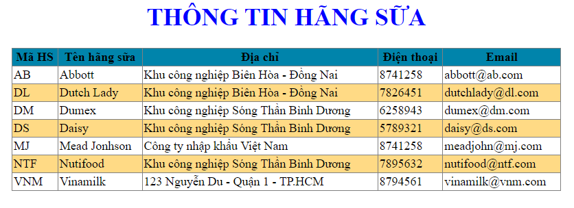
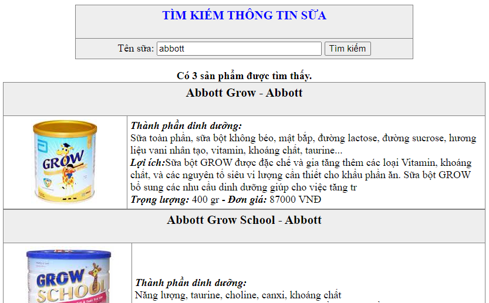
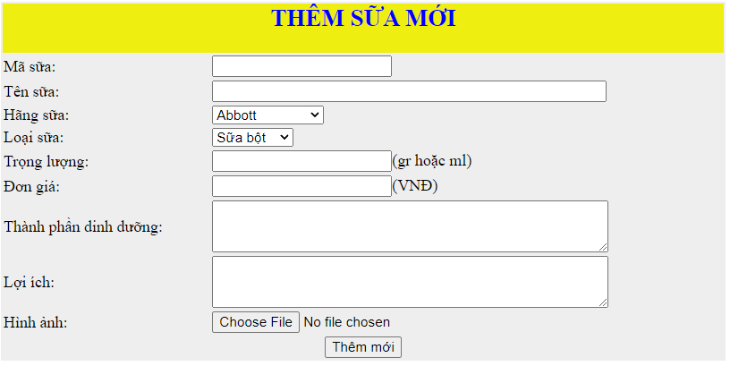

<h1>Bài tập thực hành phần CSDL MySQL</h1>

- [BÀI TẬP KHỞI ĐỘNG](#bt_khoidong) <br>		
- [BÀI TẬP TỔNG HỢP](#bt_tonghop) <br>

## BÀI TẬP KHỞI ĐỘNG <a name="bt_khoidong" />

### Tạo CSDL MySQL và thực hiện kết nối với PHP.


- [Bài 1: Tạo CSDL](#btkd_1) <br>
- [Bài 2: Kết hợp PHP và MySQL hiển thị thông tin một bảng dữ liệu](#btkd_2) <br>
- [Bài 3: Kết hợp PHP và MySQL tìm kiếm thông tin](#btkd_3) <br>
- [Bài 4: Kết hợp PHP và MySQL thêm dữ liệu vào bảng](#btkd_4) <br>


### Bài 1: Tạo CSDL <a name="btkd_1" />
- Quản lý bán hàng: Sử dụng PHPMyAdmin trong XAMPP import file qlbansua.sql.

	- Quan sát cấu trúc của các bảng trong CSDL và các dòng dữ liệu trong mỗi bảng.

	- Thực hiện nhập thêm một số dòng dữ liệu vào mỗi bảng.

	- Thực hiện một số câu truy vấn CSDL. 


### Bài 2: Kết hợp PHP và MySQL hiển thị thông tin một bảng dữ liệu<a name="btkd_2" />

- Tạo file kết nối CSDL "connect.php". 

**Lưu ý:**

  + Giá trị của hằng DB_NAME phụ thuộc vào tên file của CSDL.
  + file connect.php chứa các thông tin khai báo CSDL, được đưa vào các file script thông qua hàm `include` hoặc `require`.

```php
<?php # Script - mysqli_connect.php

// This file contains the database access information. 
// This file also establishes a connection to MySQL, 
// selects the database, and sets the encoding.

// Set the database access information as constants:
DEFINE ('DB_USER', 'root');
DEFINE ('DB_PASSWORD', '');
DEFINE ('DB_HOST', 'localhost');
DEFINE ('DB_NAME', 'qlbansua');

// Make the connection:
$dbc = @mysqli_connect (DB_HOST, DB_USER, DB_PASSWORD, DB_NAME) 
		OR die ('Could not connect to MySQL: ' . mysqli_connect_error() );

// Set the encoding...
mysqli_set_charset($dbc, 'utf8');
```

- Tạo form hiển thị thông tin các hãng sữa

Màn hình kết quả:


 <br>


- Chương trình mẫu:

```php
<!DOCTYPE HTML PUBLIC "-//W3C//DTD HTML 4.01 Frameset//EN">
<html>
<head>
<meta http-equiv="Content-Type" content="text/html; charset=utf-8">
<title>Thong tin hang sua</title>
</head>
<body>
<?php 
// Ket noi CSDL
require("connect.php");
// Chuan bi cau truy van & Thuc thi cau truy van
$strSQL = "SELECT * FROM hang_sua";
$result = mysqli_query($dbc,$strSQL);
// Xu ly du lieu tra ve
if(mysqli_num_rows($result) == 0)
{
	echo "Chưa có dữ liệu";
}
else
{	echo "<h1 style='color: blue;' align='center'>THÔNG TIN HÃNG SỮA</h1>
		  <table align='center' width='800' border='1' cellpadding='2' cellspacing='2' 
				style='border-collapse: collapse;'>
		  	<tr style='background-color: #0084ab;' align='center'>
				<td><b>Mã HS</b></td>
				<td><b>Tên hãng sữa</b></td>
				<td><b>Địa chỉ</b></td>
				<td><b>Điện thoại</b></td>
				<td><b>Email</b></td>
		  	</tr>";
	$stt=1;
	while ($row = mysqli_fetch_array($result))
	{
		if($stt%2!=0)
		{	echo "<tr>";
			echo "<td>$row[0]</td>";
			echo "<td>$row[1]</td>";
			echo "<td>$row[2]</td>";
			echo "<td>$row[3]</td>";
			echo "<td>$row[4]</td>";
			echo "</tr>";
		}
		else
		{
			echo "<tr style='background-color: #ffb1007a;'>";
			echo "<td>$row[0]</td>";
			echo "<td>$row[1]</td>";
			echo "<td>$row[2]</td>";
			echo "<td>$row[3]</td>";
			echo "<td>$row[4]</td>";
			echo "</tr>";
		}
			$stt+=1;
	}
	echo '</table>';
}
//Dong ket noi
mysqli_close($dbc);
?>
</body>
</html>
```

### Bài 3: Kết hợp PHP và MySQL tìm kiếm thông tin<a name="btkd_3" />

- Tạo form tìm kiếm thông tin sản phẩm theo dạng sau:

 <br>

Chương trình mẫu:
```php
<!DOCTYPE HTML PUBLIC "-//W3C//DTD HTML 4.01 Frameset//EN">
<html>
<head>
<meta http-equiv="Content-Type" content="text/html; charset=utf-8">
<title>Tim kiem sua</title>
</head>
<body>
<form action="" method="get">
<table bgcolor="#eeeeee" align="center" width="70%" border="1" 
	   cellpadding="5" cellspacing="5" style="border-collapse: collapse;">
<tr>
	<td align="center"><font color="blue"><h3>TÌM KIẾM THÔNG TIN SỮA</h3></font></td>
</tr>
<tr>
	<td align="center">Tên sữa: <input type="text" name="tensua" size="30" 
				value="<?php if(isset($_GET['tensua'])) echo $_GET['tensua'];?>">
			<input type="submit" name="tim" value="Tìm kiếm"></td>
</tr>
</table>
</form>
<?php 
if($_SERVER['REQUEST_METHOD']=='GET')
{
	if(empty($_GET['tensua'])) echo "<p align='center'>Vui lòng nhập tên sản phẩm</p>";
	else
	{
		$tensua=$_GET['tensua'];	
		require('connect.php');
		$query="Select sua.*, Ten_hang_sua 
		      from Sua,hang_sua 
		      WHERE sua.ma_hang_sua=hang_sua.ma_hang_sua
					AND Ten_sua like '%$tensua%'";
		$result=mysqli_query($dbc,$query);		
		if(mysqli_num_rows($result)<>0)
		{	$rows=mysqli_num_rows($result);
			echo "<div align='center'><b>Có $rows sản phẩm được tìm thấy.</b></div>";
			while($row=mysqli_fetch_array($result, MYSQLI_ASSOC))
			{
				echo '<table border="1" cellpadding="5" cellspacing="5" style="border-collapse:collapse;">
					<tr bgcolor="#eeeeee"><td colspan="2" align="center"><h3>'.
						$row['Ten_sua'].' - '.$row['Ten_hang_sua'].'</h3></td></tr>';
				echo '<tr><td width="200" align="center"></td>';
				echo '<td><i><b>Thành phần dinh dưỡng:</i></b><br />'.$row['TP_Dinh_Duong'].'<br />';
				echo '<i><b>Lợi ích:</b></i>'.$row['Loi_ich'].'<br />';
				echo '<i><b>Trọng lượng: </b></i>'.$row['Trong_luong'].' gr - <i><b>Đơn giá: </b></i>'.
						$row['Don_gia'].' VNĐ';
				echo '</td></tr></table>';
			}
		}
		else echo "<div><b>Không tìm thấy sản phẩm này.</b></div>";
	}
}
?>
</body>
</html>
```
### Bài 4: Kết hợp PHP và MySQL thêm dữ liệu vào bảng<a name="btkd_3" />
- Tạo form thêm một sản phẩm sữa vào CSDL.

 <br>

Chương trình mẫu:

```php 
<!DOCTYPE HTML PUBLIC "-//W3C//DTD HTML 4.01 Frameset//EN">
<html>
<head>
<meta http-equiv="Content-Type" content="text/html; charset=utf-8">
<title>Tìm kiếm sữa</title>
</head>
<body>
<?php 
require('connect.php');
?>
<form action="" method="post" enctype="multipart/form-data">
<table bgcolor="#eeeeee" align="center" width="60%" border="0">
<tr bgcolor="#eeee10">
	<td colspan="2" align="center"><font color="blue"><h2>THÊM SỮA MỚI</h2></font></td>
</tr>
<tr>
	<td>Mã sữa: </td>
	<td><input type="text" name="ma_sua" size="20" value="<?php if(isset($_POST['ma_sua'])) echo $_POST['ma_sua'];?>" /></td>
</tr>
<tr>
	<td>Tên sữa: </td>
	<td><input type="text" name="ten_sua" size="50" value="<?php if(isset($_POST['ten_sua'])) echo $_POST['ten_sua'];?>" /></td>
</tr>
<tr>
	<td>Hãng sữa:</td>
	<td><select name="hang_sua">
			<?php 
				$query="select * from Hang_sua";	//Hiển thị tên các hãng sữa
				$result=mysqli_query($dbc,$query);
				if(mysqli_num_rows($result)<>0){
					while($row=mysqli_fetch_array($result)){
						$ma_hang_sua=$row['Ma_hang_sua'];
						$ten_hang=$row['Ten_hang_sua'];
						echo "<option value='$ma_hang_sua' "; 
								if(isset($_REQUEST['hang_sua']) && ($_REQUEST['hang_sua']==$ma_hang_sua)) echo "selected='selected'";
						echo ">$ten_hang</option>";
					}
				}
				mysqli_free_result($result);
			?>								
		</select>
	</td>
</tr>
<tr>
	<td>Loại sữa: </td>
	<td><select name="loai_sua">
			<?php 
				$query="select * from Loai_sua";	//Hiển thị tên các loại sữa
				$result=mysqli_query($dbc,$query);
				if(mysqli_num_rows($result)<>0){
					while($row=mysqli_fetch_array($result)){
						$ma_loai_sua=$row['Ma_loai_sua'];
						$ten_loai=$row['Ten_loai'];
						echo "<option value='".$ma_loai_sua."' "; 
							if(isset($_REQUEST['loai_sua']) && ($_REQUEST['loai_sua']==$ma_loai_sua)) echo "selected='selected'";
						echo ">".$ten_loai."</option>";
					}
				}
				mysqli_free_result($result);
			?>								
		</select>
	</td>
</tr>
<tr>
	<td>Trọng lượng: </td>
	<td><input type="text" name="trong_luong" size="20" value="<?php if(isset($_POST['trong_luong'])) echo $_POST['trong_luong'];?>" />(gr hoặc ml)</td>
</tr>
<tr>
	<td>Đơn giá: </td>
	<td><input type="text" name="don_gia" size="20" value="<?php if(isset($_POST['don_gia'])) echo $_POST['don_gia'];?>" />(VNĐ)</td>
</tr>
<tr>
	<td>Thành phần dinh dưỡng: </td>
	<td><textarea name="tp_dinh_duong" rows="3" cols="50"> <?php if(isset($_POST['tp_dinh_duong'])) echo $_POST['tp_dinh_duong'];?> </textarea></td>
</tr>
<tr>
	<td>Lợi ích: </td>
	<td><textarea name="loi_ich" rows="3" cols="50"> <?php if(isset($_POST['loi_ich'])) echo $_POST['loi_ich'];?> </textarea></td>
</tr>
<tr>
	<td>Hình ảnh: </td>
	<td><input type="FILE" name ="hinh" size="80" value="<?php if(isset($_POST['hinh'])) echo $_POST['hinh'];?>" /></td>
</tr>
<tr>
	<td colspan="2" align="center"><input type="submit" name ="them" size="10" value="Thêm mới" /></td>
</tr>
</table>
</form>
<?php 
if($_SERVER['REQUEST_METHOD']=="POST"){
	$errors=array(); //khởi tạo 1 mảng chứa lỗi
	//kiem tra ma sua
	if(empty($_POST['ma_sua'])){
		$errors[]="Bạn chưa nhập mã sữa";
	}
	else{
		$ma_sua=trim($_POST['ma_sua']);
	}
	//kiểm tra tên sản phẩm
	if(empty($_POST['ten_sua'])){
		$errors[]="Bạn chưa nhập tên sữa";
	}
	else{
		$ten_sua=trim($_POST['ten_sua']);
	}
	//cap nhat ma hang sua va ma loai sua
	$ma_hang_sua=$_POST['hang_sua'];
	$ma_loai_sua=$_POST['loai_sua'];
	//kiem tra trong luong
	if(empty($_POST['trong_luong'])){
		$errors[]="Bạn chưa nhập trọng lượng";
	}
	elseif(!is_numeric($_POST['trong_luong'])){
		$errors[]="Trọng lượng phải là kiểu số";
	}
	else{
		$trong_luong=trim($_POST['trong_luong']);
	}
	//kiem tra don gia
	if(empty($_POST['don_gia'])){
		$errors[]="Bạn chưa nhập đơn giá";
	}
	elseif(!is_numeric($_POST['don_gia'])){
		$errors[]="Đon giá phải là kiểu số";
	}
	else{
		$don_gia=trim($_POST['don_gia']);
	}
	//cap nhat thanh phan dinh duong va loi ich
	$tp_dinh_duong=$_POST['tp_dinh_duong'];
	$loi_ich=$_POST['loi_ich'];
	//kiểm tra hình sản phẩm và thực hiện upload file
	if($_FILES['hinh']['name']!=""){
		$hinh=$_FILES['hinh'];
		$ten_hinh=$hinh	['name'];
		$type=$hinh['type'];
		$size=$hinh['size'];
		$tmp=$hinh['tmp_name'];
		if(($type=='image/jpeg' || ($type=='image/bmp') || ($type=='image/gif') && $size<8000))
		{
			move_uploaded_file($tmp,"Hinh_sua/".$ten_hinh);
		}
	}
	if(empty($errors))//neu khong co loi xay ra
	{ 
		$query="INSERT INTO sua VALUES ('$ma_sua','$ten_sua','$ma_hang_sua',
				'$ma_loai_sua','$trong_luong','$don_gia','$tp_dinh_duong','$loi_ich','$ten_hinh')";
		$result=mysqli_query($dbc,$query);
		if(mysqli_affected_rows($dbc)==1){//neu them thanh cong
			echo "<div align='center'>Thêm mới thành công!</div>";			
			$query="Select sua.*, Ten_hang_sua from Sua,hang_sua WHERE sua.ma_hang_sua=hang_sua.ma_hang_sua
					AND ma_sua ='". $ma_sua. "'";
			$result=mysqli_query($dbc,$query);
			if(mysqli_num_rows($result)==1)
			{	$row=mysqli_fetch_array($result, MYSQLI_ASSOC);
				echo '<table align="center" border="1" cellpadding="5" cellspacing="5" style="border-collapse:collapse;">
						<tr bgcolor="#eeeeee"><td colspan="2" align="center"><h3>'.$row['Ten_sua'].' - '.$row['Ten_hang_sua'].'</h3></td></tr>';
					echo '<tr><td></td>';
								echo '<td><i><b>Thành phần dinh dưỡng:</i></b><br />'.$row['TP_Dinh_Duong'].'<br />';
								echo '<i><b>Lợi ích:</b></i>'.$row['Loi_ich'].'<br />';
								echo '<i><b>Trọng lượng: </b></i>'.$row['Trong_luong'].' gr - <i><b>Đơn giá: </b></i>'.$row['Don_gia'].' VNĐ';
										echo '</td></tr></table>';				
			}
		}
		else //neu khong them duoc
		{
			echo "<p>Có lỗi, không thể thêm được</p>";
			echo "<p>".mysqli_error($dbc)."<br/><br />Query: ".$query."</p>";	
		}
	}
	else
	{//neu co loi
		echo "<h2>Lá»—i</h2><p>Có lỗi xảy ra:<br/>";
		foreach($errors as $msg)
		{
			echo "- $msg<br /><\n>";
		}
		echo "</p><p>Hãy thử lại.</p>";
	}
}
mysqli_close($dbc);
?>
</body>
</html>

```

## BÀI TẬP TỔNG HỢP<a name="bt_tonghop" />


- [Bài 1: Tạo CSDL quản lý nhân viên](#btth_1) <br>
- [Bài 2: Tạo các form hiển thị thông tin](#btth_2) <br> 
- [Bài 3: Tạo các form tra cứu thông tin](#btth_3) <br>
- [Bài 4: Tạo các form thêm thông tin](#btth_4) <br>


### Bài 1: Tạo CSDL quản lý nhân viên sử dụng PHPMyAdmin<a name="btth_1" />

- Tạo CSDL gồm các bảng sau:

	+ LOAINV(MALOAINV,TENLOAINV).

	+ NHANVIEN(MANV,HO,TEN,NGAYSINH,GIOITINH,DIACHI,ANH,MALOAINV,MAPHONG)

	+ PHONGBAN(MAPHONG,TENPHONG) 

- Tạo kết nối giữa các bảng.

- Nhập dữ liệu vào các bảng.


### Bài 2: Tạo các form hiển thị thông tin<a name="btth_2" />

- Tạo giao diện chính có các nút điều hướng hoặc menu điều khiển, liên kết với các trang xử lý khác.

- Dựa trên **Bài tập 2** phần Bài tập khởi động tạo các form hiển thị thông tin của các đối tượng: Phòng, Nhân viên, Loại nhân viên. Từ giao diện chính, sử dụng các nút điều hướng/menu điều khiển để lựa chọn mở từng trang tương ứng.

### Bài 3: Tạo các form tra cứu thông tin<a name="btth_3" />


- Dựa trên **Bài tập 3** phần Bài tập khởi động tạo các form tra cứu thông tin của các đối tượng: Phòng, Nhân viên, Loại nhân viên. 

- Từ giao diện chính, bổ sung thêm các nút điều hướng/menu điều khiển để lựa chọn mở từng trang tìm kiếm tương ứng.

### Bài 4: Tạo các form thêm dữ liệu vào các bảng<a name="btth_4" />


- Dựa trên **Bài tập 4** phần Bài tập khởi động tạo các form thêm dữ liệu vào các bảng: Phòng, Nhân viên, Loại nhân viên. 

- Từ giao diện chính, bổ sung thêm các nút điều hướng/menu điều khiển để lựa chọn mở từng trang thêm dữ liệu tương ứng.